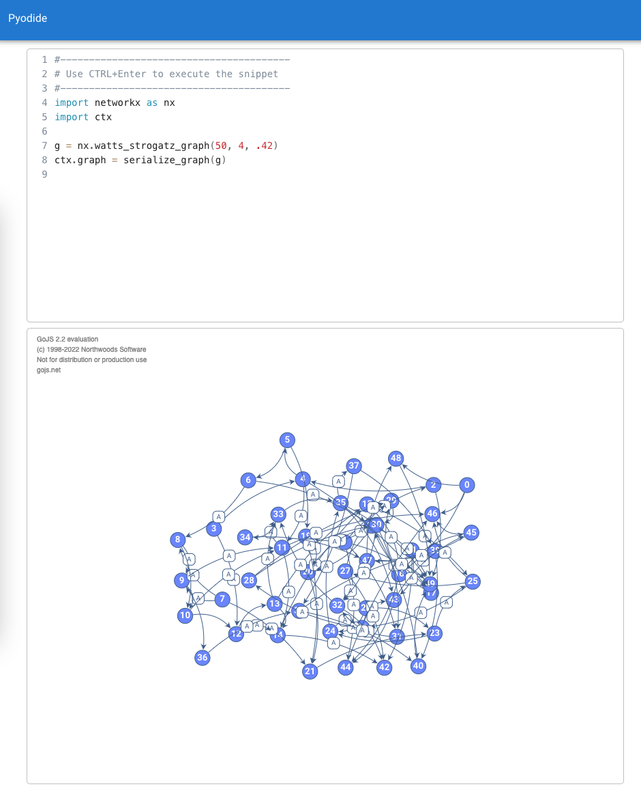

# Vue Go Pyodide

Use of Pyodide and NetworkX to create graphs and visualize them using Go.js. All within the browser.

To install use the standard `npm i` and run it with `npm start`.

The necessary Pyodide files are included in the repo and consist of around 30MB. The full Pyodide is almost 300MB and contains heaps of Python packages (with advanced things like scikit, pandas, whatnot).

